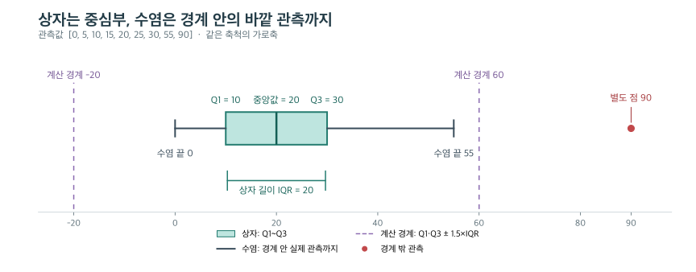

그래프 코드는 **무엇을 그릴지**와 **어디에 그릴지**를 나누면 읽기 쉽다. `x="age"`는 사용할 값이고 `ax=axes[0]`은 그릴 장소다. 먼저 [[data/statistics-data-and-groups|변수의 의미]]를 정하고, 분포의 어떤 부분을 비교할지 선택한다.

아래 질문의 의도는 실제 대화 맥락을 바탕으로 해석했다. 코드는 설명용으로 재구성했으며, 직접 작성한 응답은 [[learning/2026-09-29-statistics|당일 기록]]에서 따로 확인한다.

## 질문: 퍼짐 그래프와 히스토그램·KDE를 스스로 작성하려면 어떻게 읽어야 하나?

**상황:** 표준편차가 퍼짐을 요약한다는 것은 알지만 `fig`, `axes`가 낯설어, 나중에 문제를 혼자 풀 수 있을 정도로 그래프 작성 과정을 설명해 달라고 했다.

**의도:** 코드를 통째로 외우는 대신 비교 목적에서 각 인수를 선택할 수 있게 되려는 요청이다.

**핵심 답변:** `plt.subplots()`로 전체 그림과 그래프 영역을 만들고, Seaborn에 데이터·표현 방식·그릴 영역을 전달한다. 이후 해당 영역에 제목을 붙인다.

```python
fig, ax = plt.subplots(figsize=(8, 4))
sns.histplot(data=df, x="age", bins=20, ax=ax)
ax.set_title("Age histogram")
plt.show()
```

| 표현 | 역할 |
| --- | --- |
| `fig` | 모든 그래프 영역을 담는 Figure |
| `ax` | 눈금·제목·데이터를 포함하는 그래프 영역 Axes 하나 |
| `data=df, x="age"` | 표에서 `age` 열을 찾아 사용 |
| `bins=20` | 수치 범위를 20개 구간으로 나눔 |
| `ax=ax` | 왼쪽은 인수 이름, 오른쪽은 만들어 둔 영역 변수 |

`Axes`는 x축 하나라는 뜻이 아니다. `figsize`는 그림 전체 크기를 인치로 정하며 `subplots(1, 2)`의 1·2는 그래프 배치의 행·열 수다. 기본 `squeeze=True`에서 영역 하나는 Axes 객체, 1행 2열은 Axes 두 개의 1차원 배열을 반환한다. 변수명을 `axes`로 쓴다고 자동으로 여러 영역이 되지는 않는다. [Matplotlib subplots 문서](https://matplotlib.org/stable/api/_as_gen/matplotlib.pyplot.subplots.html)

같은 평균을 가진 `A=[49,50,51]`, `B=[10,50,90]`의 퍼짐은 같은 x축으로 비교한다.

```python
A = [49, 50, 51]
B = [10, 50, 90]
fig, axes = plt.subplots(1, 2, figsize=(10, 3), sharex=True)
sns.stripplot(x=A, ax=axes[0])
sns.stripplot(x=B, ax=axes[1])
axes[0].set_title("A")
axes[1].set_title("B")
plt.show()
```

점은 원래 관측값이다. 표준편차를 점으로 그린 것이 아니다. 두 축의 범위가 각자 자동 확대되면 작은 퍼짐도 크게 보일 수 있어 `sharex=True`로 기준을 맞춘다. `np.std()`의 기본 `ddof=0`으로 계산하면 A는 약 0.82, B는 약 32.66이다. `pandas.Series.std()`는 기본 `ddof=1`이므로 비교할 때 계산 기준도 맞춘다.

히스토그램은 **수치 구간별 개수**, KDE는 **부드럽게 추정한 밀도**다. `bins=20`은 구간마다 20명을 넣는다는 뜻이 아니며, 빈 구간의 막대 높이는 0이다. KDE의 구간 비중은 한 점의 높이가 아니라 곡선 아래 면적으로 읽는다. 둘을 겹치면 세로축을 밀도로 맞춘다.

```python
fig, ax = plt.subplots()
sns.histplot(data=df, x="age", bins=25,
             stat="density", alpha=0.35, ax=ax)
sns.kdeplot(data=df, x="age", ax=ax)
plt.show()
```

밀도 히스토그램의 **막대 면적 합**이 1이다. 높이 합이 1이라는 뜻이 아니다. 같은 `ax`가 두 그림을 겹치는 연결이다. KDE는 `bins` 대신 `bw_adjust` 같은 대역폭 조정으로 굴곡을 바꿀 수 있으며, 매끄러운 곡선이 관측 사실 자체는 아니다. [Seaborn histplot 문서](https://seaborn.pydata.org/generated/seaborn.histplot.html)

## 질문: plt와 sns는 다른 라이브러리인데 같은 그림인 줄 어떻게 아나? figure() 때문에 ax를 생략하나?

**상황:** `plt.figure()` 다음에 `sns.boxplot()`과 `plt.title()`이 이어지는데 같은 그림에 그리라는 명시적 연결이 보이지 않았다. 이후 `figure()`와 `ax` 생략의 관계를 다시 물었다.

**의도:** 두 라이브러리가 그림을 공유하는 숨은 실행 상태를 확인하려는 질문이다.

**핵심 답변:** Seaborn은 Matplotlib을 기반으로 하며, 여기서 쓰는 Axes 수준 함수는 `ax`를 생략하면 현재 Axes를 사용한다. `figure()` 자체가 `ax` 생략을 허용하는 특별한 기능은 아니다.

```python
plt.figure(figsize=(8, 3))  # 새 Figure를 현재 대상으로 지정
sns.boxplot(x=df["fare"])  # 현재 Axes 사용, 없으면 마련
plt.title("Fare")         # 현재 Axes의 제목
plt.show()
```

`plt.subplots()`는 Figure와 Axes를 함께 만들어 반환한다. 그것으로 만들었어도 `ax`를 생략할 수 있지만, 영역이 여러 개면 `ax=axes[0]`처럼 대상을 드러내는 편이 읽기 쉽다. 개별 제목은 `ax.set_title()`, 그림 전체 제목은 `fig.suptitle()`이다.

## 질문: quantile()은 무엇을 반환하고, lower·upper와 수염 끝은 어떻게 다른가?

**상황:** 사분위수 코드에서 `quantile()`만 이해하면 될 것 같다고 물었다. 이어 Q1·Q3에서 IQR의 일정 배수만큼 떨어진 경계와 그 안의 실제 최솟값·최댓값을 구분해 설명했다.

**의도:** 분위수의 위치와 실제 값, 계산 경계와 그래프에 표시되는 수염을 연결하려는 질문이다.

**핵심 답변:** `quantile(0.25)`의 0.25는 위치를 정하는 비율이고, 반환값은 원래 변수의 단위를 가진 값이다. Q1·Q3의 차이가 IQR이며, 기본 1.5×IQR 규칙의 수염은 경계 안쪽의 실제 관측값까지 이어진다.

```python
s = pd.Series([0, 5, 10, 15, 20, 25, 30, 55, 90])
q1, q2, q3 = s.quantile([0.25, 0.50, 0.75])
iqr = q3 - q1
lower = q1 - 1.5 * iqr
upper = q3 + 1.5 * iqr
```

위 배열은 **정리 단계에서 추가한 수치 예시**다. 당시 사용자가 직접 작성한 실습으로 기록하지 않는다.

| 부분 | 계산 또는 값 |
| --- | --- |
| Q1 / 중앙값 Q2 / Q3 | 10 / 20 / 30 |
| IQR | `30 - 10 = 20` |
| 아래·위 판정 경계 | `10 - 30 = -20` / `30 + 30 = 60` |
| 실제 수염 끝 | 0 / 55 |
| 수염 밖의 점 | 90 |



*같은 축척으로 그린 편집용 예시다. 보라색 점선은 계산 경계이며 실제 박스플롯의 수염과 다르다.*

상자는 Q1부터 Q3까지다. 음수 경계가 있다고 음수 관측값이 있다는 뜻은 아니다. 경계와 같은 관측값은 수염 안에 포함한다. `whis` 등 설정을 바꾸면 수염의 규칙도 달라지므로 여기서는 기본 1.5×IQR 규칙을 전제로 한다. [Matplotlib boxplot 문서](https://matplotlib.org/stable/api/_as_gen/matplotlib.pyplot.boxplot.html)

분위수는 보간으로 계산될 수 있다. `[10,20,30,40]`의 중앙값은 실제 원소에 없는 25다. `quantile()`을 쓰기 전에 직접 정렬할 필요는 없다. [pandas quantile 문서](https://pandas.pydata.org/docs/reference/api/pandas.Series.quantile.html)

이상치 후보만 고를 때는 경계 **밖** 조건을 쓴다.

```python
outliers = s[(s < lower) | (s > upper)]  # 값 90을 선택
```

각 비교식을 괄호로 감싸고 Series의 원소별 OR인 `|`로 연결한다. `&`로 바꾸면 lower보다 작으면서 upper보다 커야 하므로 이 조건에서는 아무 값도 남지 않는다. 선택·정렬 후에도 원래 인덱스는 유지되며, **후보 표시가 삭제 결정은 아니다**.

## 질문: 왜 상자와 수염을 나눠 그리나? 가운데 절반은 어떤 절반인가?

**상황:** 원래 세션 이후 정리 과정에서 상자와 수염을 나누는 이유, 특히 “가운데 50%”가 무엇의 절반인지 추가로 확인했다. 이 절은 그 후속 질문을 반영한 보충 설명이다.

**의도:** 박스플롯의 부품 이름보다 각 부분이 보여 주는 정보의 차이를 이해하려는 질문이다.

**핵심 답변:** 상자는 **정렬한 자료의 25% 위치부터 75% 위치까지**, 즉 중심부의 퍼짐을 보여 준다. 수염은 그 밖에도 관측값이 어디까지 이어지는지 보여 주되, IQR 경계 바깥 값은 별도 점으로 분리한다. 중심부와 바깥쪽 분포를 한 그림에서 따로 읽으려는 구성이다.

예시 `[0, 5, 10, 15, 20, 25, 30, 55, 90]`에서는 작은 순서로 본 25% 위치의 값이 10, 75% 위치의 값이 30이다. 따라서 상자는 10~30이고 그 길이인 IQR은 20이다. **최솟값 0부터 최댓값 90까지의 숫자 범위를 반으로 자른다는 뜻이 아니다.**

“가운데 50%”는 분위수로 정한 위치 구간을 부르는 말이다. 표본이 9개라고 상자 안에 정확히 4.5개의 점을 넣는 것은 아니다. 이 예에서 양 끝을 포함해 10~30에 놓인 실제 관측은 5개다. 작은 표본의 보간 방법이나 같은 값의 반복 때문에 포함되는 점의 수가 항상 전체의 정확한 절반이 되지는 않는다.

| 구분 | 이 예의 위치 | 따로 보여 주는 이유 |
| --- | --- | --- |
| 상자 | 10~30 | 중심부가 좁게 몰렸는지 넓게 퍼졌는지 비교 |
| 중앙선 | 20 | 중심부 안에서 중앙값이 어디 있는지 표시 |
| 수염 | 아래는 10에서 0까지, 위는 30에서 55까지 | IQR 경계 안의 바깥 관측까지 얼마나 이어지는지 표시 |
| 별도 점 | 90 | 중심부에 비해 멀리 떨어진 관측을 따로 드러냄 |

최솟값~최댓값 선 하나만 있으면 중심부가 어디에 얼마나 모였는지 놓친다. 상자만 있으면 그 바깥에도 값이 얼마나 이어지는지 놓친다. 그래서 상자와 수염을 함께 보되, 수염 안의 모든 값이 “정상”, 별도 점이 “오류”라는 뜻으로 읽지 않는다.

## 질문: 로그 변환은 실제 요금 의미를 잃는 눈속임 아닌가? 배열을 주면 x를 생략해도 되나?

**상황:** `np.log1p(df["fare"])`로 치우침을 줄여도 가로축이 실제 요금이 아니게 된다는 점을 지적했다. 세로축도 실제 개수가 아닌지, `data`에 값 자체를 넣으면 어떻게 되는지 함께 물었다.

**의도:** 보기 좋은 모양과 해석 가능한 표현을 구분하고 데이터 전달 방식도 확인하려는 질문이다.

**핵심 답변:** 로그 변환은 큰 값 사이의 간격을 압축하지만 읽는 단위가 바뀐다. 기본 `histplot`의 세로축은 여전히 해당 구간의 실제 개수다. 변환 후 구간 경계가 달라지므로 막대별 개수는 원래 그래프와 달라질 수 있다.

`log1p(x)`는 자연로그 `ln(1+x)`이며 요금 0도 0으로 변환한다. 0 이상의 요금에서는 순서를 유지하고 `expm1`로 되돌릴 수 있다. 원래 금액을 직접 읽기는 어려워져도 값을 되돌릴 정보가 사라진 것은 아니다. [NumPy log1p 문서](https://numpy.org/doc/stable/reference/generated/numpy.log1p.html)

아래는 데이터 전달 방식을 비교한 대안들이다. **한 번에 한 줄을 골라 그린다.**

```python
sns.histplot(data=df, x="fare")       # 표에서 열 이름으로 선택
sns.histplot(x=df["fare"])            # 값 자체를 x에 전달
sns.histplot(data=df["fare"])         # 1차원 Series 자체를 전달
sns.histplot(x=np.log1p(df["fare"]))  # 계산한 값 자체를 전달
```

여러 열인 `data=df`만 주면 원하는 `fare` 열 하나를 알아서 선택하지 않는다. 원본 요금과 변환 요금을 비교하려면 서로 다른 Axes에 그리고 변환 축임을 표시한다. “대칭처럼 보이므로 좋아졌다”로 끝내지 말고, 실제 금액을 읽을 목적과 상대적 차이를 볼 목적을 구분한다. 이 코드는 변환 결과를 그릴 뿐 `df["fare"]`를 덮어쓰지 않는다.

## 퀴즈: 위 경계가 60인데 왜 수염은 55에서 끝날까?

위 설명용 배열에서 60은 실제 관측값이 아니다. 수염이 60이 아닌 55에서 끝나는 이유와, 90을 자동 삭제하면 안 되는 이유를 설명해 보자.

<details>
<summary>정답과 이유 보기</summary>

60은 IQR로 계산한 판정 경계이고, 그 안에서 가장 큰 실제 관측값은 55이기 때문이다. 90은 규칙상 이상치 후보이지만 실제 고액 관측일 수 있어 원자료와 분석 목적을 확인해야 한다.

</details>

*새로 만든 보충 문제이며 사용자 응답 기록은 아니다.*

**연결:** [[data/eda-and-causality|평균 뒤의 분포]] · [[data/statistics-data-and-groups|변수와 요약표]] · [[data/statistics-relations-and-interpretation|집단별 분포의 해석]] · [[learning/2026-09-29-statistics|실제 질문과 코드 교정]]
